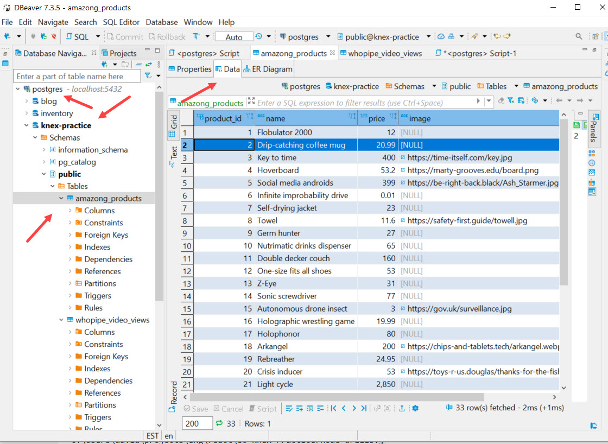

## >> Project Name:

Practice-Drill--Knex-PostgreSQL

## >> Project Summary:

This project requires us to set up a comprehensive SQL database development environment using [postgreSQL](https://www.postgresql.org/) and KNEX, a SQL query builder library.

The toolsets provided by PostgreSQL and  [Dbeaver](https://dbeaver.io), a DB GUI client was used to set up multiple databases.

These tools were also used to query the database using some of the basic SQL syntax such as ```SELECT, WHERE, LIKE, ILIKE, LIMIT, OFFSET, now(), count(), GROUP BY, ORDER BY , ASC, DESC.```

The project also requires us to construct a set of SQL queries  programmatically with the use of the KNEX API library 


## >> Screenshots

Dbeaver SQL table query


## >> Technologies used in this APP:

```
* Knex
* Knex's Promise-like object/syntax
* SQL queries
* Query builder
* Node
* doenv 
* DBeaver 
* Javascript
```

Postgres commands used(partial list)
```
psql 
pg_ctl
createuse
createdb
```
-> Tools
* VSC Debugger


